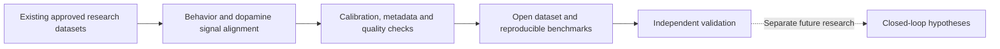

# Dopamine-OS

**Measure. Record. Understand. Build toward better lives.**

An open research vision for connecting behavior with dopamine measurements — starting with reproducible data, with the long-term ambition of helping people with Parkinson's disease.

**Status: concept proposal · Seeking scientific collaborators, funding, people, and resources**

[English](README.md) · [繁體中文／廣東話](docs/i18n/README.zh-Hant.md) · [简体中文](docs/i18n/README.zh-Hans.md) · [Español](docs/i18n/README.es.md) · [Français](docs/i18n/README.fr.md) · [Português](docs/i18n/README.pt.md) · [Deutsch](docs/i18n/README.de.md) · [日本語](docs/i18n/README.ja.md) · [한국어](docs/i18n/README.ko.md) · [العربية](docs/i18n/README.ar.md) · [हिन्दी](docs/i18n/README.hi.md) · [Bahasa Indonesia](docs/i18n/README.id.md)

[Research & venture whitepaper](docs/WHITEPAPER.md) · [繁體中文白皮書](docs/WHITEPAPER.zh-Hant.md) · [Contribute](CONTRIBUTING.md) · **[Talk to the founder on Telegram: @csakwild91](https://t.me/csakwild91)**

## From the founder

> I am a dreamer, an idealist, and a developer who uses AI professionally. My goal is to help everyone in the world.
>
> I am not a scientist, and I have not studied medicine. The original idea and summary grew out of roughly ten minutes of conversation with Gemini. I personally believe this direction could become practical and help address Parkinson's disease. That belief is my starting hypothesis; the conversation did not establish scientific feasibility.
>
> If you want to invest in an ambitious attempt to change the world, give me people, resources, and the chance to try. I want to bring qualified scientists and engineers together, test the idea, and turn what survives those tests into something real. Contact me on Telegram: **@csakwild91**.

**Founder:** [rgamingbc](https://github.com/rgamingbc) · **Contact:** [t.me/csakwild91](https://t.me/csakwild91)

The founder's role is vision, AI-assisted development, and convening collaborators. Scientific and clinical decisions require qualified partners. Gemini is the origin of an ideation conversation, not a collaborator or endorsement.

## The mission

Can a shared, carefully measured record of behavior and dopamine dynamics help researchers ask better questions about movement and neurological disease?

Dopamine-OS proposes an open effort to synchronize behavioral observations with dopamine measurements, document their limitations, and compare findings across sessions and laboratories. The proposed **DA-OS Matrix** is a context-dependent research dataset and model, not a universal lookup table that assigns one dopamine dose to every movement.

**The ambition is global. The first deliverable must be measurable.**

## The research direction

The starting point is existing data shared with permission by qualified laboratories. Future recordings would belong to approved institutional research, with appropriate animal welfare oversight. This repository contains no invasive experimental instructions.

Candidate measurement methods include [fast-scan cyclic voltammetry (FSCV)](https://pmc.ncbi.nlm.nih.gov/articles/PMC7028514/) and [GRAB dopamine sensors](https://www.nature.com/articles/s41592-020-00981-9). Both are established research approaches; the project does not claim to have invented them. Sampling rate, sensor kinetics, calibration, and artifacts must be documented. A fluorescence trace is not automatically an absolute dopamine concentration.

For interoperability, the proposal would build on [Neurodata Without Borders (NWB)](https://nwb.org/) where appropriate, rather than invent an isolated data format.

## What must be tested

| Proposed milestone | Evidence required |
| --- | --- |
| Scientific scoping | Expert review identifies a narrow question, existing work, and a falsifiable hypothesis. |
| First data demonstration | A permission-cleared dataset can be loaded, synchronized, and inspected reproducibly. |
| DA-OS research benchmark | Models are evaluated on held-out animals and sessions, with appropriate baselines and uncertainty reporting. |
| Independent replication | Another team reproduces the analysis; cross-laboratory transfer is measured, not assumed. |
| Later closed-loop research | Qualified partners separately establish causal relevance, safety, and any regulatory requirements. |

**Current repository deliverables:** the proposal, whitepapers, translated introductions, and contribution guidance. No DA-OS device, dataset, trained model, clinical study, or therapeutic result is provided here.

Parkinson's disease involves more than dopamine loss, and a correlation between a signal and a movement does not establish a treatment. See the [NINDS disease overview](https://www.ninds.nih.gov/current-research/focus-disorders/parkinsons-disease-research/parkinsons-disease-challenges-progress-and-promise). This proposal does not establish a cure, exact dopamine dosing, or direct transfer from animal observations to humans.

Cell regeneration, optogenetic interventions, and adaptive treatment are separate research questions. They are not outputs that a behavior–dopamine table can automatically deliver. Existing [adaptive deep brain stimulation research](https://pubmed.ncbi.nlm.nih.gov/39160351/) is relevant prior work, not proof of this proposal.

## The commercial ambition

Build useful research infrastructure first: data integration, quality control, reproducible analysis, and collaboration across laboratories.

If validated and adopted, possible business models include supported research software, integration services, and research partnerships. Any clinical product would require a separate evidence and development program.

The founder's **“trillion-dollar ambition”** expresses the scale of the dream. It is not a measured market size, a valuation, or an investment return forecast. Human enhancement and robotics are distant exploratory possibilities, not validated markets or current products.

Open collaboration should create value through execution, trust, and useful tools. This repository does not claim exclusive ownership of dopamine measurement, a patent monopoly over a biological relationship, or rights to partners' data.

## People and resources wanted

- **Neuroscientists and clinicians:** challenge the hypothesis, narrow the question, and lead scientific evaluation.
- **Laboratories:** identify suitable existing recordings, permissions, and possible research partnerships.
- **AI and data engineers:** help design synchronization, quality checks, benchmarks, and reproducible analysis.
- **Investors and philanthropists:** fund expert review, engineering time, lawful data access, and an independently assessed first demonstration.
- **Translators and community builders:** help this idea reach people across languages and disciplines.

There is no published fundraising amount, financial model, signed laboratory partnership, or investment offer in this repository. The first funding conversation should define a scoped milestone, named responsibilities, a budget, and evidence that would justify continuing.

**If you can bring capital, people, a laboratory, or other resources to make this attempt real, [contact @csakwild91 on Telegram](https://t.me/csakwild91).** Scientific criticism and evidence against the idea are welcome too.

## Open documentation

Copyright © 2026 rgamingbc. Original project documentation is shared under [CC BY 4.0](LICENSE). Third-party papers and datasets keep their own licenses. Future software and contributed datasets will need explicit licenses; none are supplied in this initial release.

Translations are introductions to the same proposal; the English whitepaper contains the detailed research framing. Corrections are welcome through [GitHub Issues](https://github.com/rgamingbc/Dopamine-OS/issues).

*A ten-minute conversation started the idea. Evidence must decide what happens next.*
